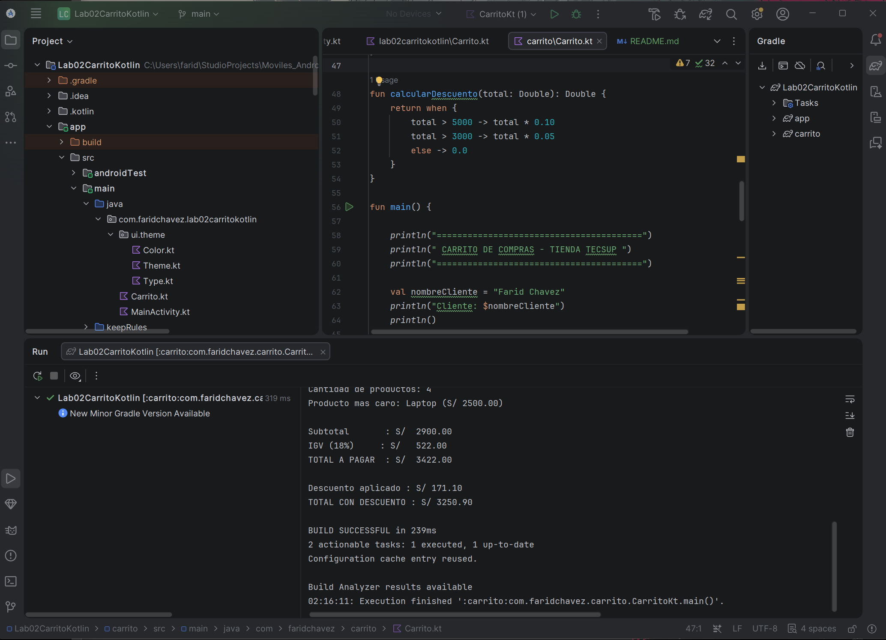

# Laboratorio 02 - Carrito de Compras en Kotlin

## Estudiante
Farid Chavez

## Descripción

En este laboratorio se desarrolló un programa en Kotlin que simula un carrito de compras de una tienda.

El programa permite registrar productos con su nombre, precio y cantidad. También muestra el detalle de los productos del carrito y realiza los cálculos necesarios para obtener el subtotal, IGV y total a pagar.

Además, se agregó una función para identificar el producto más caro y una función para aplicar descuentos dependiendo del monto total de la compra.

## Funciones implementadas

### calcularSubtotal()
Calcula el subtotal sumando el precio de cada producto multiplicado por su cantidad.

### calcularIGV()
Calcula el IGV correspondiente al 18% del subtotal.

### calcularTotal()
Calcula el total de la compra sumando el subtotal y el IGV.

### mostrarDetalle()
Muestra los productos del carrito de manera ordenada, indicando nombre, cantidad e importe.

### calcularDescuento()
Calcula el descuento utilizando `when`.

- Si el total supera S/ 5000, aplica 10% de descuento.
- Si el total supera S/ 3000, aplica 5% de descuento.
- En caso contrario, no se aplica descuento.

También se utilizó `maxByOrNull` para encontrar el producto con el precio más alto.

## Diferencia entre val y var

En Kotlin, `val` se utiliza cuando una variable no necesita cambiar su valor después de ser asignada. En cambio, `var` permite que el valor de una variable pueda modificarse durante la ejecución del programa.

En este laboratorio se utilizó `val` para datos que no necesitaban cambiar y `var` cuando era necesario modificar un valor, por ejemplo al acumular el subtotal.

## Resultado del programa

