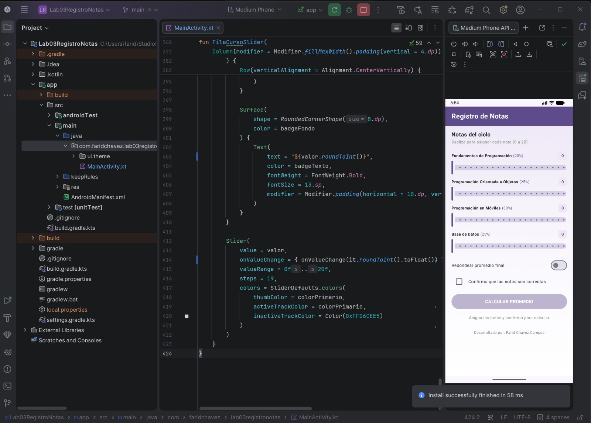
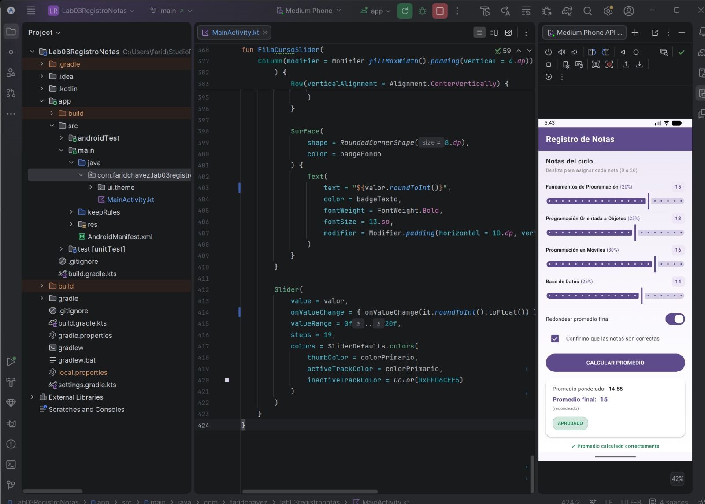

# Laboratorio 03: Registro de Notas

**Estudiante:** Farid Chavez Campos  
**Curso:** Programación en Móviles  
**Docente:** Juan León Suiyon

## Descripción
Aplicación móvil desarrollada con Jetpack Compose que implementa controles interactivos (`Slider`, `Switch`, `Checkbox`) para calcular el promedio ponderado de 4 cursos con pesos específicos, opción de redondeo y emisión de observaciones dinámicas con chips de colores.

## Capturas de Pantalla

### Estado Inicial

### Promedio Calculado y Observación

## Casos de Prueba Verificados

| Notas (F, POO, M, BD) | Redondear | Prom. ponderado | Prom. final | Observación |
|---|---|---|---|---|
| 15, 13, 16, 14 | ON | 14.55 | 15 | APROBADO |
| 12, 10, 11, 9 | OFF | 10.45 | 10.45 | EN RECUPERACIÓN |
| 18, 17, 19, 18 | ON | 18.05 | 18 | EXCELENTE |
| 8, 9, 7, 10 | OFF | 8.45 | 8.45 | DESAPROBADO |