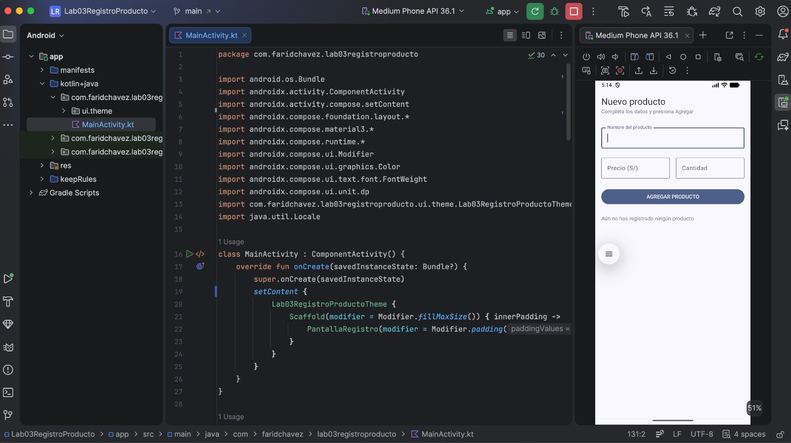
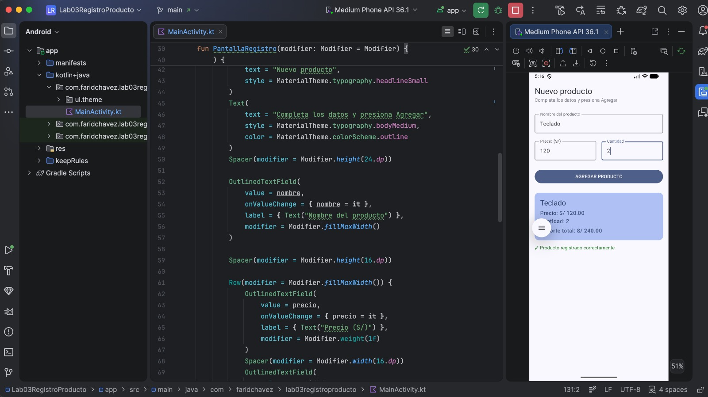

# Laboratorio 03: Registro de Producto
**Estudiante:** Farid Chavez Campos  
**Curso:** Programación en Móviles

## Descripción
Aplicación móvil desarrollada con Jetpack Compose que implementa un formulario para el registro de productos con cálculo automático de importe total y persistencia temporal reactiva mediante mutableStateOf y remember.

## Capturas de Pantalla

### Pantalla Inicial

### Producto Registrado

## Pregunta de Reflexión: remember

### ¿Qué pasaría si declaras las variables de los campos SIN remember?
Si se declaran las variables de estado utilizando únicamente `mutableStateOf("")` sin envolverlas en `remember`, el estado se reinicializa a su valor por defecto cada vez que el composable se recompone. En consecuencia, cada vez que el usuario teclea una letra o número, Compose redibuja la interfaz, la variable vuelve a quedar vacía y el texto ingresado nunca llega a visualizarse en el campo.