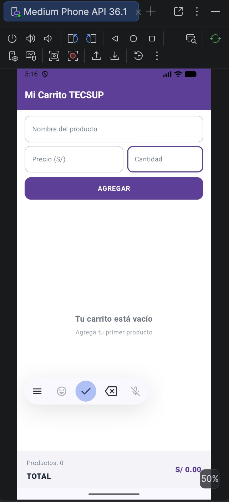
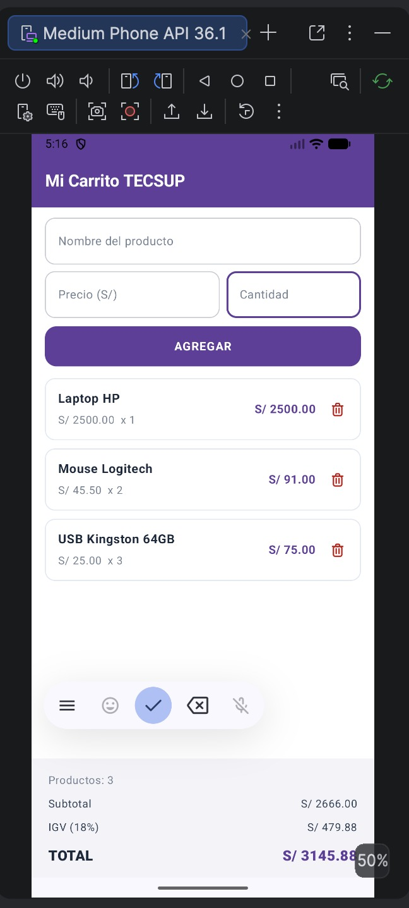

# Laboratorio 04: Carrito de Compras en Jetpack Compose

**Estudiante:** Farid Chávez  
**Curso:** Desarrollo de Aplicaciones Móviles  
**Institución:** TECSUP

---

## 1. Descripción del Proyecto

Aplicación móvil desarrollada en Android utilizando Jetpack Compose que implementa la arquitectura reactiva de un carrito de compras. La solución permite:
* Registrar artículos ingresando nombre, precio unitario y cantidad mediante campos de texto (`OutlinedTextField`).
* Listar los productos de forma dinámica y eficiente mediante una lista optimizada (`LazyColumn`).
* Eliminar elementos individuales con confirmación de seguridad previa (`AlertDialog`).
* Calcular en tiempo real el subtotal, descuento condicional progresivo mediante `when`, cálculo de IGV (18%) y el importe total a pagar.
* Gestionar la interfaz de estado vacío mediante un contenedor `Box` cuando la colección no contiene elementos.

---

## 2. Respuestas a Preguntas Conceptuales

### ¿Por qué se utiliza `mutableStateListOf` en lugar de una lista convencional como `ArrayList` o `List`?
En Jetpack Compose, la recomposición automática de la interfaz depende de estructuras reactivas observables. Colecciones comunes como `ArrayList` o `List` permiten modificar sus elementos en memoria pero no notifican al runtime de Compose ante cambios. Por el contrario, `mutableStateListOf` emite avisos de cambio estructural frente a operaciones como `.add()` o `.remove()`, lo que dispara la recomposición inmediata de la `LazyColumn`, contadores y paneles de cálculo.

### ¿Cuál es la diferencia de rendimiento entre `Column` y `LazyColumn` en Compose?
* **Column:** Instancia, mide y dibuja en pantalla todos sus elementos hijos al mismo tiempo al renderizarse, sin importar si entran o no en el espacio visible de la pantalla. En listas medianas o grandes esto satura la memoria RAM y reduce los fotogramas por segundo.
* **LazyColumn:** Aplica el principio de virtualización (similar a `RecyclerView`). Únicamente compone, mide y renderiza los elementos visibles dentro del viewport actual a medida que el usuario hace scroll, garantizando un desplazamiento fluido y uso óptimo de recursos.

### ¿Cómo garantiza la arquitectura el cálculo en tiempo real del Subtotal, IGV y Total?
Se calculan como **estados derivados** (`derived state`) directamente en el cuerpo composable a partir de la colección observable:
* `val totalCantidad = productos.size`
* `val subtotal = productos.sumOf { it.precio * it.cantidad }`
* Descuento condicional evaluado con `when`
* `val igv = subtotalConDescuento * 0.18`
* `val totalPagar = subtotalConDescuento + igv`

Al derivarse directamente de la lista reactiva `productos`, cualquier alta o baja recalcula los importes de forma automática y sincronizada, sin necesidad de manejadores de eventos manuales.

---

## 3. Funcionalidades Adicionales Implementadas (+2 Puntos)

* **Confirmación de borrado con AlertDialog (+1 pto):** Al presionar el tacho rojo se despliega un diálogo de confirmación con las opciones *Cancelar* y *Eliminar*, evitando la eliminación accidental de artículos.
* **Descuento dinámico con `when` (+1 pto):** Lógica que evalúa el subtotal aplicando un 5% de descuento sobre compras mayores a S/ 3,000.00 y un 10% sobre compras superiores a S/ 5,000.00, visualizándose en el panel únicamente cuando se alcanza dicho monto.

---

## 4. Capturas de Pantalla

| Carrito Vacío (`Box`) | Carrito con Productos y Totales |
| :---: | :---: |
|  |  |

---

## 5. Historial de Commits

1. `Proyecto inicial`
2. `Formulario agrega productos a lista observable`
3. `Avance: LazyColumn inicial`
4. `Agrega TarjetaProducto con boton eliminar`
5. `Agrega panel de totales y estado vacio con Box`
6. `README con capturas y respuestas conceptuales`